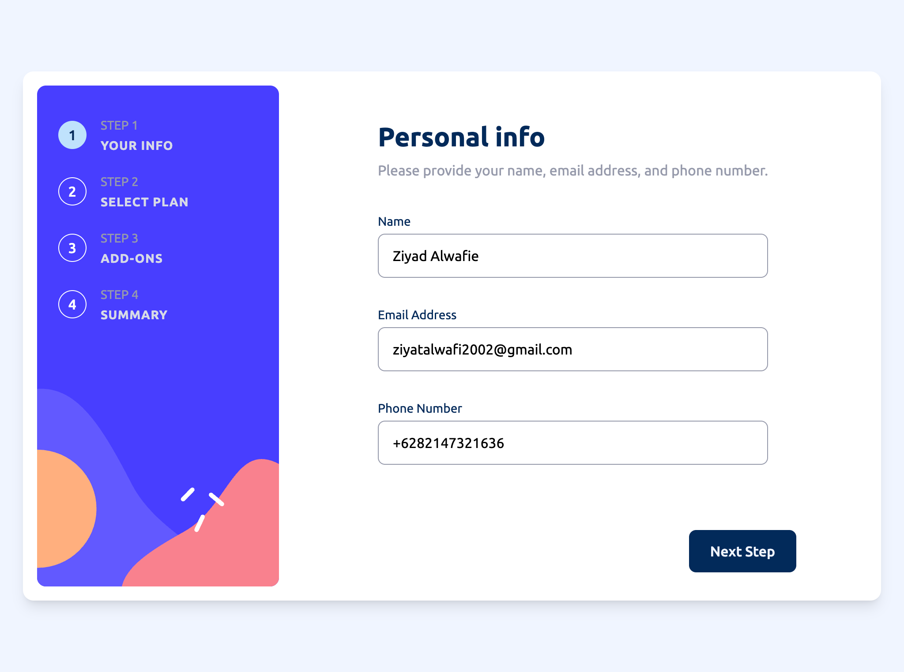

# Frontend Mentor - Multi-step form solution

This is a solution to the [Multi-step form challenge on Frontend Mentor](https://www.frontendmentor.io/challenges/multistep-form-YVAnSdqQBJ). Frontend Mentor challenges help you improve your coding skills by building realistic projects.

## Table of contents

- [Overview](#overview)
    - [The challenge](#the-challenge)
    - [Screenshot](#screenshot)
    - [Links](#links)
- [My process](#my-process)
    - [Built with](#built-with)
    - [What I learned](#what-i-learned)
    - [Continued development](#continued-development)
    - [Useful resources](#useful-resources)
    - [AI Collaboration](#ai-collaboration)
- [Author](#author)

## Overview

### The challenge

Users should be able to:

- Complete each step of the sequence
- Go back to a previous step to update their selections
- See a summary of their selections on the final step and confirm their order
- View the optimal layout for the interface depending on their device's screen size
- See hover and focus states for all interactive elements on the page
- Receive form validation messages if:
    - A field has been missed
    - The email address is not formatted correctly
    - A step is submitted, but no selection has been made

### Screenshot

### Links

- Solution URL: [Add solution URL here](https://your-solution-url.com)
- Live Site URL: [Add live site URL here](https://github.zyalwfie.io/multi-step-form)

## My process

### Built with

- React (Vite)
- Tailwind CSS
- Mobile-first workflow
- Component-based architecture
- Controlled form inputs with centralized state management

### What I learned

This project helped me better understand how to manage multi-step form state in React without losing user input when navigating between steps. I structured the form data in a single state object and controlled navigation using a step index, which made the flow predictable and easier to debug.

I also improved my approach to per-step validation logic, ensuring users cannot proceed without completing required fields or making necessary selections. Handling conditional rendering for plans, add-ons, and dynamic price calculations reinforced my understanding of derived state and clean UI separation.

### Continued development

In future projects, I want to explore:
- Extracting validation logic into reusable utilities or custom hooks  
- Improving accessibility (ARIA attributes and better keyboard support)  
- Adding smooth step transition animations
- Writing unit tests for validation and step logic

### Useful resources

- React documentation – for managing controlled inputs and component structure
- Tailwind CSS documentation – for responsive layout and state styling  
- Frontend Mentor community solutions – for comparing architectural approaches

### AI Collaboration

I used ChatGPT to help refine component structure ideas, improve validation flow logic, and polish documentation. It was particularly helpful in clarifying architectural decisions and improving written explanations. All implementation decisions and code structure were reviewed and adjusted manually to fit the project requirements.

## Author

- Website - [Ziyad Alwafie](https://zyalwfie.com)
- Frontend Mentor - [@zyalwfie](https://www.frontendmentor.io/profile/zyalwfie)
